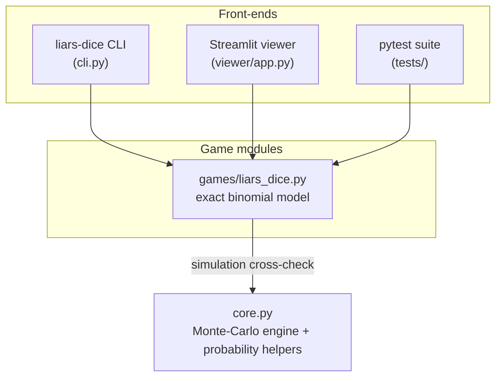

# Architecture

The whole project is built around one rule: **exact math where it's tractable,
simulation where it's not, and the simulator doubles as a check on the exact
math.**

## The layers



Three things fall out of this shape:

* `core.py` knows nothing about any game. It can estimate P(event) for any
  trial function you hand it, and it reports the standard error so you know
  how much to trust the estimate.
* Every front-end (CLI, Streamlit app, tests) imports the same game module,
  so the number you see at the table is the same number the tests verify.
* Adding a game never touches the engine. Drop a module in `games/`, expose
  functions that return probabilities or EV, done.

## Liar's Dice: how the model works

The question the model answers: *given the total dice on the table, my own
hand, and a bid of "Q dice showing face F", what is the probability the bid
stands if challenged?*

### House rules it encodes

* 1s are wild and count toward any bid, **except** when the bid itself is on
  1s (then only literal 1s count).
* Ties favor the bidder: if the count is exactly Q, a challenger loses.
* The "within 1" red die: if a challenged bidder is exactly one short, they
  roll a single red d6. If it shows F exactly (no wilds on this roll, so 1/6),
  the bid stands anyway.

### The exact computation (`assess_bid`)

Step by step:

1. **Split the table into known and unknown.** You can see your own hand;
   everything else is `unknown = total_dice - len(hand)` independent d6 rolls.

2. **Count guaranteed matches in your hand.** For a bid on face F, that's
   your Fs plus your wild 1s (or just literal 1s if F == 1). Call it `m`.

3. **Figure out what you still need.** The bid claims Q matches exist, you
   hold `m`, so you need `k = Q - m` from the unknown dice.

4. **Per-die match probability.** Each unknown die independently shows F or a
   wild 1 with probability `p = 2/6`, or `1/6` on a 1s-bid. That makes the
   unknown match count a Binomial(n = unknown, p) variable, which is the whole
   trick: once the dice are i.i.d., no simulation is needed.

5. **Binomial tail.** P(bid literally true) = P(X >= k), summed straight from
   the binomial pmf. No approximations, `math.comb` all the way down.

6. **Red die correction.** P(exactly one short) = P(X == k-1). In that state
   the bidder survives with probability 1/6, so:

   ```
   P(bid stands) = P(X >= k)  +  P(X == k-1) * 1/6
   ```

The result comes back as a `BidAssessment` dataclass carrying every
intermediate number (unknown dice, your matches, per-die probability, the raw
tail, the one-short probability, the red-die bonus). The CLI and the Streamlit
app just format those fields; they do zero math of their own.

### Calling "liar" (`assess_call`)

Calling is the complement: `P(you win the call) = 1 - P(bid stands)`. The
`CallAssessment` adds a decision rule (call when P(bid false) clears a
threshold, default 0.5) and an expected die swing so you can see how lopsided
the spot is. The red die is included in the bidder's survival by default
because it only ever helps them.

### The simulation cross-check (`simulate_bid`)

The exact math is easy to get subtly wrong (off-by-one in the tail, wilds on
1s-bids, the red-die edge case). So the module also ships a brute-force
version that plays the situation out:

1. Roll every unknown die with the RNG.
2. Count matches the same way the rules do, add your hand's matches.
3. If count >= Q, the bid stands. If count == Q - 1, roll the red die and
   check for exactly F.
4. Repeat ~50k times through `core.monte_carlo` and take the hit rate.

`tests/test_liars_dice.py` asserts the closed-form answer and the simulated
answer agree within 1% across several bids, including a 1s-bid. If either
implementation drifts from the rules, the two stop agreeing and the suite
fails. Two independent implementations, one source of truth.

## Other games

The `games/` layout and the game-agnostic engine exist so more games can plug
in. A poker equity model (exact hand evaluator + simulated Hold'em equity,
same philosophy with the balance flipped toward simulation) is being built in
a separate repo and will land here or link from here once it's done.

## Determinism

Everything that samples takes a `seed`. Same seed, same answer, which is what
lets the simulation-vs-exact tests assert tight tolerances without flaking.
