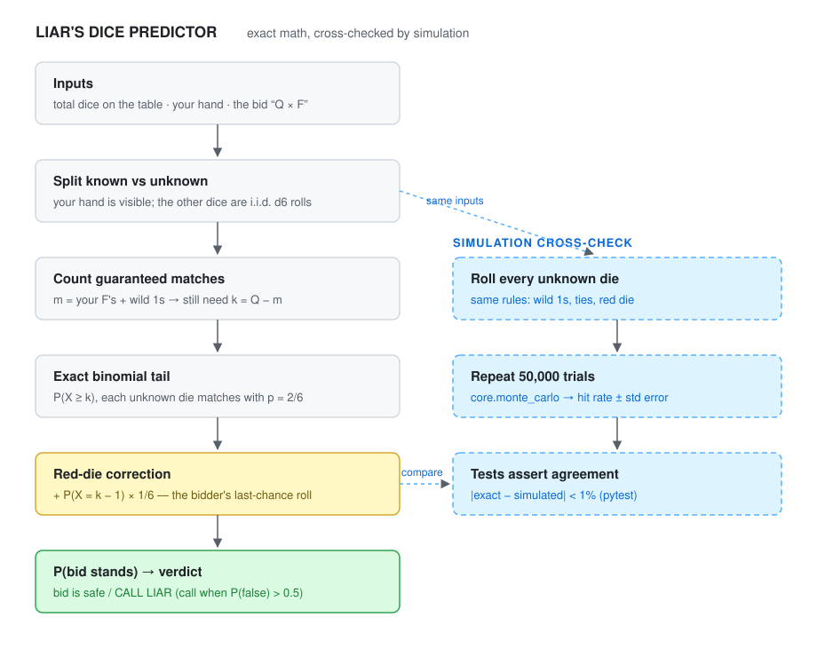

# liars-dice-predictor

Odds and move predictions for Liar's Dice. Started this to settle arguments at
game night: when someone bids "8 threes", is calling them a liar actually the
right play? Turns out you can just compute it.

<picture>
  <source media="(prefers-color-scheme: dark)" srcset="assets/logic-flow-dark.svg">
  
</picture>

**[ARCHITECTURE.md](ARCHITECTURE.md)** walks through every box above in detail:
how the bid probability is computed exactly, and how the Monte-Carlo simulation
double-checks it.

## What's here

```
src/prediction_models/
├── core.py            # Monte-Carlo simulator + probability helpers
└── games/
    └── liars_dice.py  # Liar's Dice bid/call probabilities
tests/                 # pytest suite
viewer/                # Streamlit app
```

The dice math is tractable, so it's done in closed form (binomial tails, no
approximations). The Monte-Carlo engine in `core.py` exists to brute-force the
same situations as a cross-check: the tests assert the exact math and the
simulation agree within 1%. A poker equity model built on the same engine is
in a separate repo until it's finished.

## Setup

```bash
python3 -m venv .venv
source .venv/bin/activate
pip install -r requirements.txt
pip install .             # installs the package + the `liars-dice` command
```

Heads up if you're on Python 3.13/3.14: use a plain `pip install .`, not
`pip install -e .`. Editable installs silently break on this build (the
`__editable__*.pth` path lines get skipped). Tests don't need an install at
all since `pyproject.toml` puts `src/` on the path.

## Usage

```bash
pytest        # run the suite
liars-dice    # interactive table-side predictor
```

Or from Python:

```python
from prediction_models.games import liars_dice as ld

# 25 dice on the table, my hand is [1, 3, 3, 5, 6]. The 1 is wild so I hold
# 3 guaranteed threes. Is "8 threes" a safe bid?
a = ld.assess_bid(total_dice=25, bid_quantity=8, bid_face=3, hand=[1, 3, 3, 5, 6])
print(a.summary())
print(a.probability)   # ~0.864, probability the bid stands
```

Should I call liar?

```python
c = ld.assess_call(total_dice=25, bid_quantity=12, bid_face=3, hand=[1, 3, 3, 5, 6])
c.prob_bid_false    # ~0.785, P(bidder loses if you call)
c.should_call       # True
```

House rules baked in: 1s are wild (except on bids of 1s), ties favor the
bidder, and if a challenged bid comes up exactly one short the bidder gets a
last-chance roll of a single red die (1/6 to survive). All of that is folded
into the headline probability. Pass `use_red_die=False` or `ones_wild=False`
if your table plays differently.

## The Streamlit viewer

```bash
pip install -r viewer/requirements.txt
streamlit run viewer/app.py
```

Same engine as the CLI and tests, just with sliders and a verdict.

## Adding a game

The layout is built for more games than dice. Drop a module in
`src/prediction_models/games/`, expose functions that return probabilities or
EV, lean on `core.monte_carlo` when exact math isn't practical, and add a
test file.
