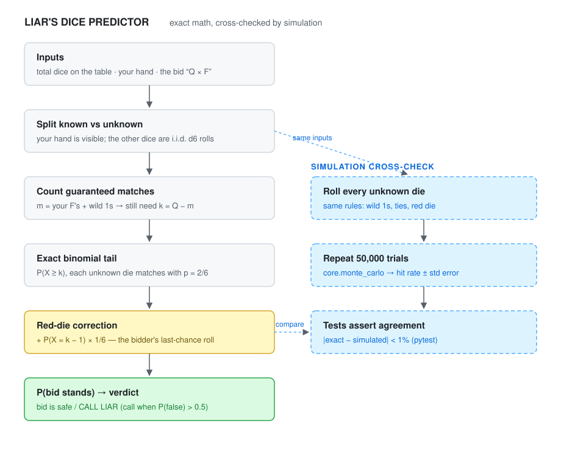

# liars-dice-predictor

[](https://github.com/torinbrekke-design/liars-dice-predictor/actions/workflows/tests.yml)

Odds and move predictions for Liar's Dice. Started this to settle arguments at
game night: when someone bids "8 threes", is calling them a liar actually the
right play? The answer can be computed exactly.

<picture>
  <source media="(prefers-color-scheme: dark)" srcset="assets/logic-flow-dark.svg">
  
</picture>

**[ARCHITECTURE.md](ARCHITECTURE.md)** explains each step in the diagram: how
the bid probability is computed exactly, and how the Monte Carlo simulation
checks it.

## What's here

```
src/prediction_models/
├── core.py            # Monte-Carlo simulator + probability helpers
└── games/
    └── liars_dice.py  # Liar's Dice bid/call probabilities
tests/                 # pytest suite
viewer/                # Streamlit app
```

The dice probabilities have an exact closed-form answer (binomial tails, no
approximations). The Monte Carlo simulator in `core.py` runs the same
situations as a check (see Validation below). A poker equity model built on the
same simulator is in a separate repo until it is finished.

## Validation

The exact binomial math is checked against a Monte Carlo simulation that plays
out random hands (50,000 trials by default). The test suite runs the simulation
at 60,000 trials on four bids, including a bid on 1s, and fails if the exact and
simulated probabilities differ by 1 percentage point or more
(`tests/test_liars_dice.py::test_exact_matches_simulation`). The tests run on
every push through GitHub Actions.

## Setup

```bash
python3 -m venv .venv
source .venv/bin/activate
pip install -r requirements.txt
pip install .             # installs the package + the `liars-dice` command
```

On Python 3.13 and 3.14, use `pip install .` rather than `pip install -e .`.
Editable installs do not work there because the `__editable__*.pth` path lines
are skipped. The tests do not need an install, since `pyproject.toml` puts
`src/` on the path.

## Usage

```bash
pytest        # run the suite
liars-dice    # interactive table-side predictor
```

Or from Python:

```python
from prediction_models.games import liars_dice as ld

# 25 dice on the table, my hand is [1, 3, 3, 5, 6]. The 1 is wild so I hold
# 3 guaranteed threes. Is "8 threes" a safe bid?
a = ld.assess_bid(total_dice=25, bid_quantity=8, bid_face=3, hand=[1, 3, 3, 5, 6])
print(a.summary())
print(a.probability)   # ~0.864, probability the bid stands
```

Should I call liar?

```python
c = ld.assess_call(total_dice=25, bid_quantity=12, bid_face=3, hand=[1, 3, 3, 5, 6])
c.prob_bid_false    # ~0.785, P(bidder loses if you call)
c.should_call       # True
```

House rules: 1s are wild (except on bids of 1s), ties favor the bidder, and if
a challenged bid comes up exactly one short, the bidder gets a last-chance roll
of a single red die (1/6 to survive). All of these rules are included in the
probability. Pass `use_red_die=False` or `ones_wild=False`
if your table plays differently.

## The Streamlit viewer

```bash
pip install -r viewer/requirements.txt
streamlit run viewer/app.py
```

It uses the same engine as the command-line tool and the tests, with sliders
for input and a recommendation on whether to call.

## Adding a game

The package is set up for more games than dice. To add one, create a module in
`src/prediction_models/games/`, write functions that return probabilities or
expected value, use `core.monte_carlo` when exact math is not practical, and
add a test file.
